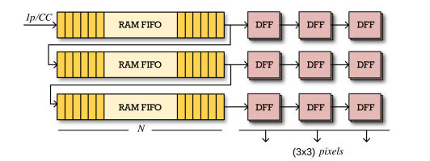

# Debayering Filter With VHDL

[](https://www.xilinx.com/products/design-tools/vivado.html) 

This project is a part of a course "VLSI Digital Systems" of National Technical University of Athens. The grade of this project was 10/10.

## First Part

The first part is to design a debayering filter with the GBRG method (more about the debayering technique can be found [here](https://en.wikipedia.org/wiki/Demosaicing) ) using VHDL that is compatible with the [Zybo Z7 development board](https://digilent.com/reference/programmable-logic/zybo-z7/start) and the Xilinx [Zynq 7000](https://www.xilinx.com/products/silicon-devices/soc/zynq-7000.html) SoC. The build was handled by the Vivado along with the simulation of the filter on a testbench also build using VHDL. The project uses a stream of $N^2$ bytes in order to generate a $N * N$ RGB values. 

The implementation uses the method of "sliding window" in order to achieve the calculation of neighbour pixels and calculate the RGB values.

A visual of the sliding window mechanism with one input and 3 outputs used in the FPGA can be shown below:



The files for the first part are located in the ```Debayering_Filter``` folder.

## Second Part

For the second part the concept is the same except for this time instead of the simulation the actual Zybo Z7 board is used. For this purpose the code of the debayering filter has slightly changed of the one used on the first part due to an incompatibility between the actual hardware and the simulation (which is caused because the simulation does not run the ```Synthesis``` step of the build process ).

Also for the second part we build a C programm that runs on the integrated ARM chip inside the Zynq 7000 SoC that runs a benchmark of running the same debayering filter build with C and directly build in the FPGA and also for doing a cross check between the 2 sets of results to proove that the FPGA is correctly build.

Finally, the FPGA inside the Zynq 7000 uses [AXI DMA](https://www.xilinx.com/products/intellectual-property/axi_dma.html) which is a custom Direct Memory Access protocol to have an improved throughput.

A visual representation of the usage of the DMA concept in our project is shown below.


The files for the first part are located in the ```Zybo_Z7_Compatiomple_Version``` folder.

## PC Script

For cross checking the results of the simulation on the first part and also for debugging a custom script is made in a form of a Python Jupyter Notebook and is located in the ```bayer.ipynb``` file.